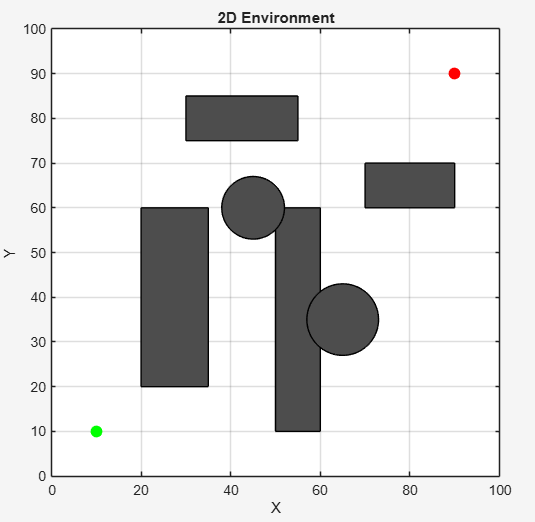
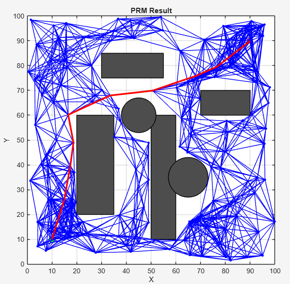
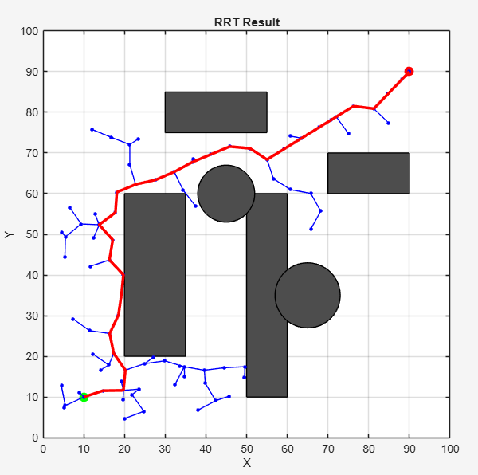
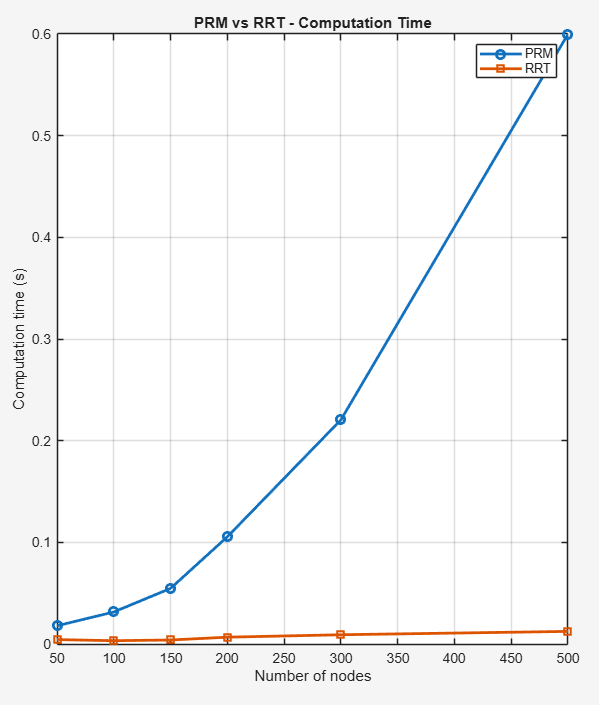
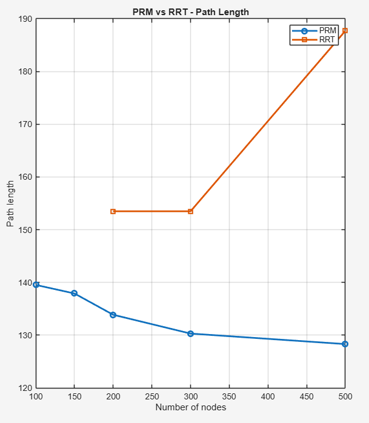
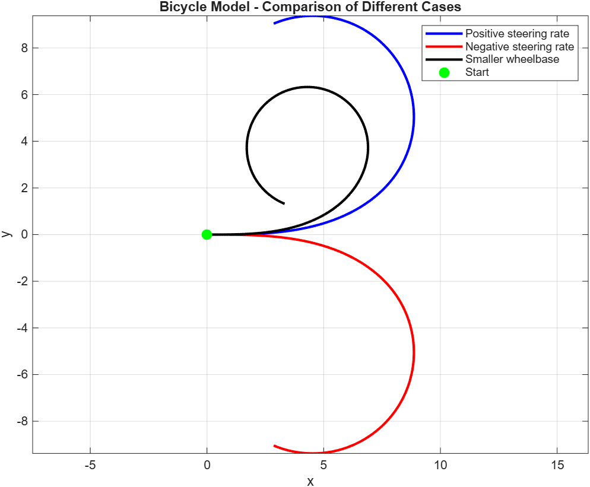
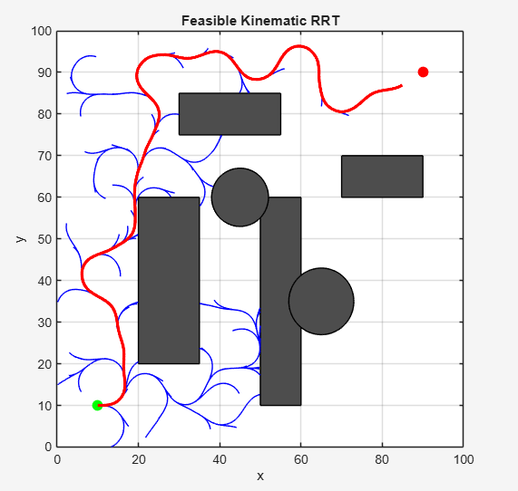
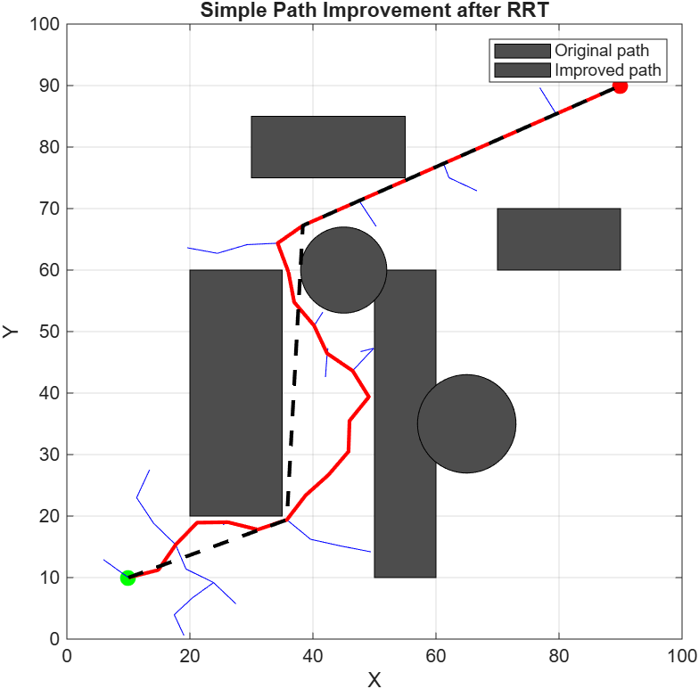
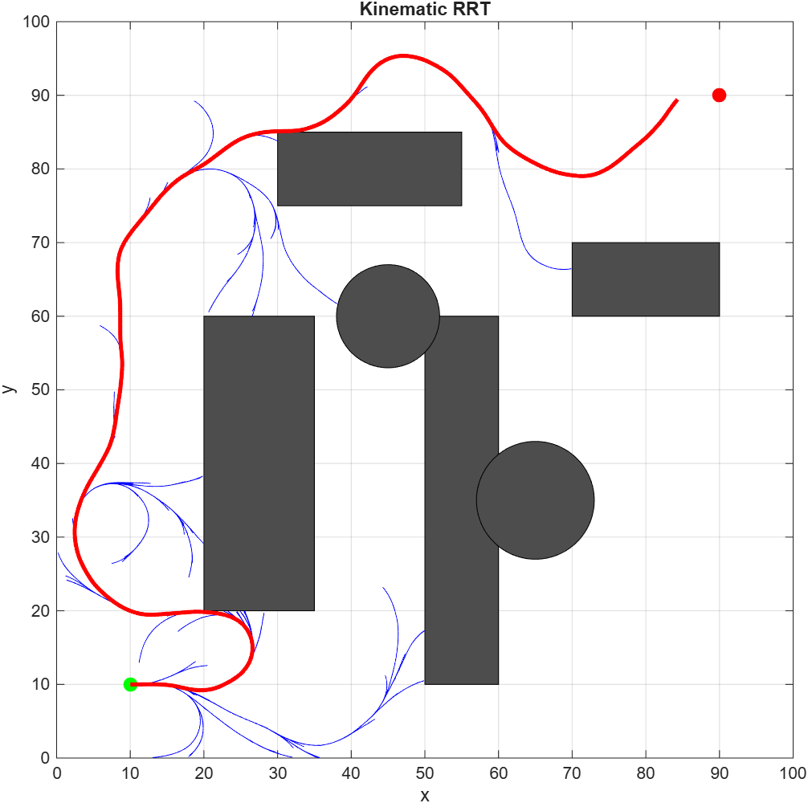

# PRM vs RRT Path Planning

This project focuses on the implementation and comparison of two classical path planning algorithms: PRM (Probabilistic Roadmap) and RRT (Rapidly-exploring Random Tree).

The goal was to study how both methods behave in the same 2D environment with obstacles, and to compare their performance in terms of computation time and path quality.

---

## Project Overview

A 2D environment was created with:
- rectangular and circular obstacles  
- a defined start point  
- a defined goal point  

Both algorithms were applied on the same map to keep the comparison consistent.

---

## PRM (Probabilistic Roadmap)

PRM works by first sampling random points in the free space, then connecting nearby nodes to form a graph.  
Once the roadmap is built, a shortest path algorithm is used to connect the start to the goal.

This approach generally produces clean and relatively optimal paths, but becomes slower when the number of nodes increases.

---

## RRT (Rapidly-exploring Random Tree)

RRT builds a tree starting from the initial position and expands it step by step toward randomly sampled points.

It is faster and simpler to implement, but the resulting path is usually less direct due to the random exploration.

---

## Results

### Example Environment

### PRM Result

### RRT Result

---

## Performance Comparison

### Computation Time

PRM becomes more expensive as the number of nodes increases due to graph construction.  
RRT remains faster in most cases.

### Path Length

PRM produces shorter and more stable paths.  
RRT tends to generate longer paths because of its exploration strategy.

---

## Conclusion

Both algorithms have their advantages.

PRM is more suitable when path quality is important, especially in static environments.  
RRT is more efficient when quick exploration is needed.

The choice between the two depends on the application constraints.

---

# PRM vs RRT Path Planning

This project focuses on the implementation and comparison of several path planning approaches, starting from classical algorithms and extending them to more realistic motion constraints.

The work is divided into two main parts:
- Classical planning (PRM vs RRT)
- Planning with kinematic constraints (bicycle model + RRT extensions)

---

## Project Overview

A 2D environment was created with:
- rectangular and circular obstacles  
- a start point  
- a goal point  

All algorithms are tested on the same environment to keep the comparison consistent.

---

## Part 1 — PRM vs RRT

### PRM (Probabilistic Roadmap)

PRM builds a graph of collision-free points and connects them locally.  
It usually produces clean and relatively optimal paths.

### RRT (Rapidly-exploring Random Tree)

RRT explores the space incrementally using random sampling.  
It is fast and simple but often generates less optimal paths.

---

## Part 2 — Kinematic Constraints

### Bicycle Model

A bicycle model was implemented to simulate realistic motion.

We can clearly see how steering direction and wheelbase affect the trajectory.

---

### Kinematic RRT

The RRT algorithm was modified to generate feasible trajectories instead of straight lines.

The tree now follows smooth curves, which better represents real vehicle motion.

---

### Feasible Kinematic RRT

The algorithm was improved by selecting nodes based on reachable trajectories instead of simple distance.

This results in a more structured tree and better exploration of the environment.

---

### Path Improvement

A simple post-processing step was applied to reduce unnecessary detours.

The improved path is shorter and more direct.

---

## Visualization

Below is an example of how the solution is progressively built:

This animation shows how the tree expands and eventually finds a valid path.

---

## Key Observations

- PRM produces better paths but is computationally expensive  
- RRT is fast but less optimal  
- Kinematic constraints make the problem more realistic  
- Using feasible trajectories improves the exploration  
- A simple post-processing step can significantly improve the final path  

---

## Project Structure

## Author

Adham Ahmed Salah Ali  
Engineering student in Robotics
